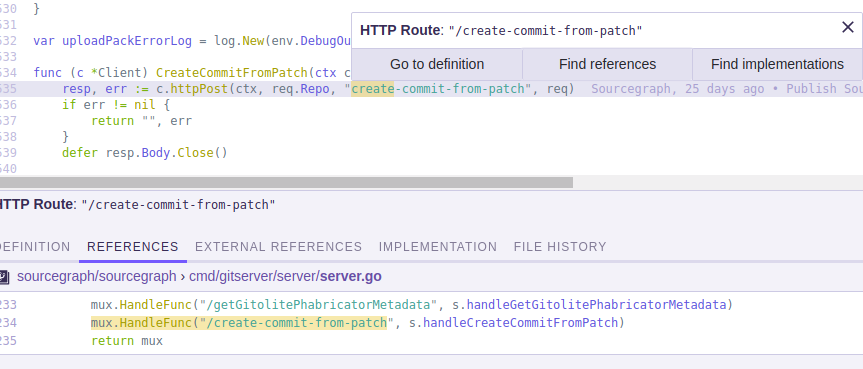

# Sourcegraph Configurable References

[![travis][travis-image]][travis-url] [![npm][npm-image]][npm-url]

[travis-image]: https://img.shields.io/travis/lguychard/sourcegraph-configurable-references/master.svg
[travis-url]: https://travis-ci.org/lguychard/sourcegraph-configurable-references
[npm-image]: https://img.shields.io/npm/v/sourcegraph-configurable-references.svg
[npm-url]: https://npmjs.org/package/sourcegraph-configurable-references

A Sourcegraph extension allowing you to add and configure reference finding for custom entities (for instance HTTP routes, build tasks, string literals...) using regular expressions.

## Configuration

Custom references can be added through the `"customReferences"` property of the Sourcegraph client settings. Here is an example configuration to add reference finding for HTTP routes in go:

```
"customReferences": [
    {
      "name": "HTTP Route",
      "preview": ": `\"/$1\"`",
      "definitions": [{
          "search": "/httpPost\\(ctx, req.Repo, \"$1/",
          "capture": "httpPost\\(ctx, req\\.Repo, \"/?([^\"]+)\""
        }],
      "references": [{
          "search": "mux.HandleFunc\\(\\\"\\/$1",
          "capture": "mux.HandleFunc\\(\"/([^\"]+)"
      }],
      "implementations": [],
    }
  ]
```

With this configuration, hovering HTTP route definitions will trigger a tooltip a tooltip allowing to find references:



## Defaults

If your Sourcegraph configuration does not have a `"customReferences"` field, the extension will create it, and include by default the configuration for string literal references
